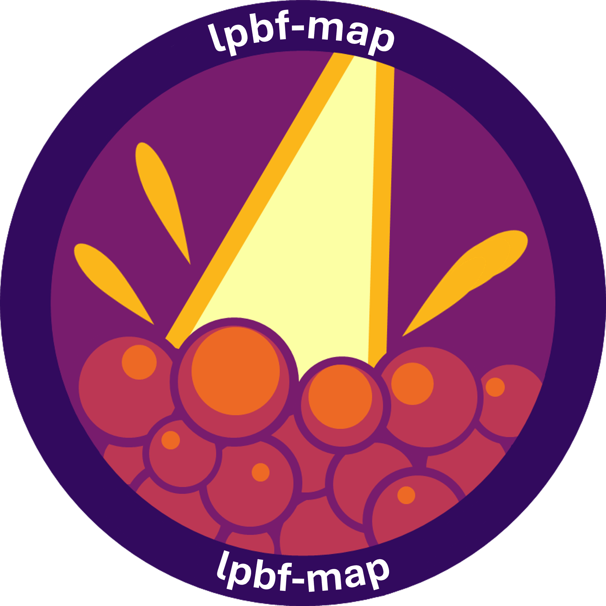
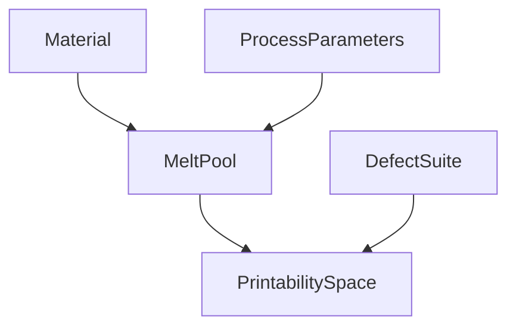
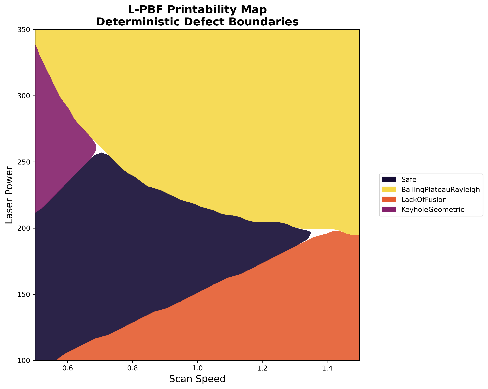
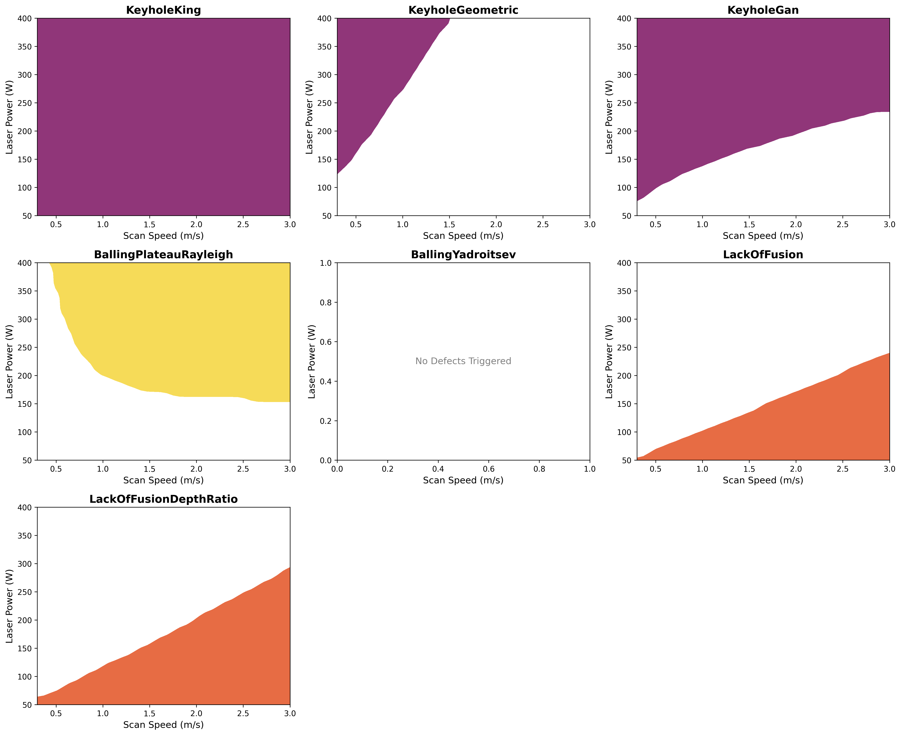
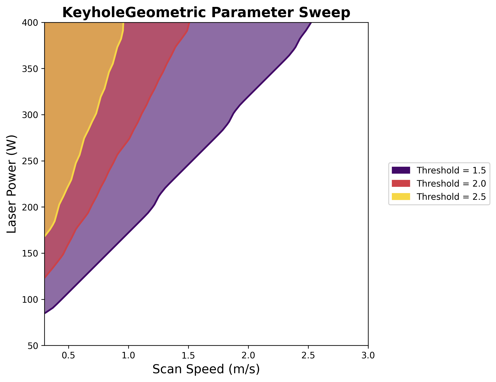
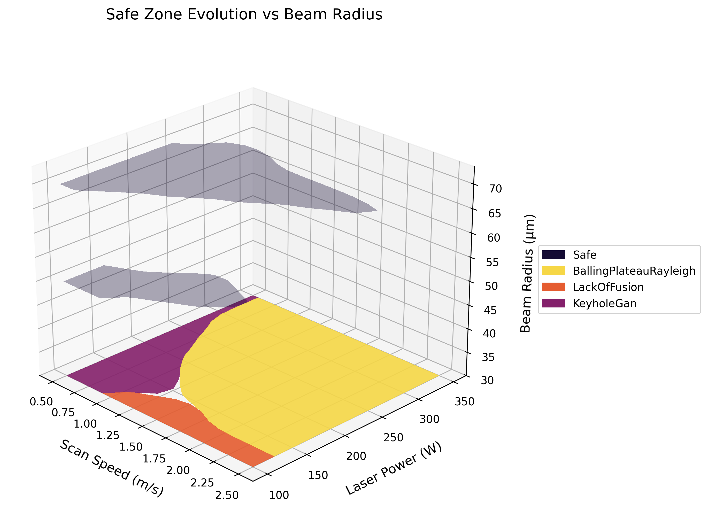
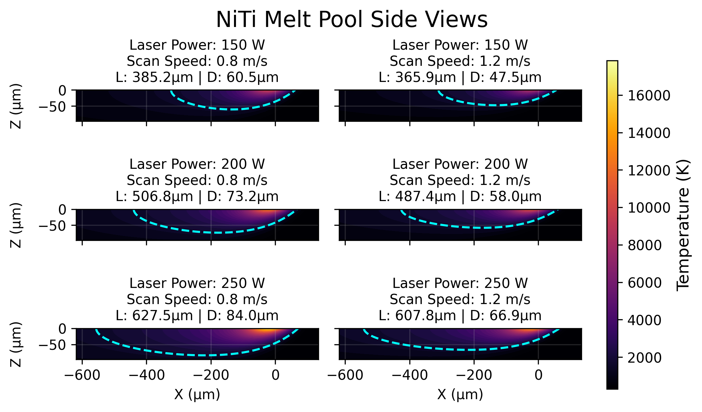
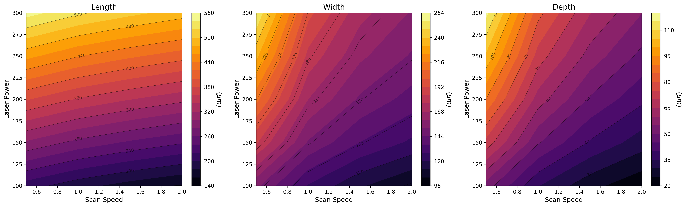

[](https://opensource.org/licenses/)
[](https://www.python.org/downloads/)
[](https://github.com/ilidio-costa/L-PBF-Processing-Maps-Predictive-Analytical-Modelling/releases)

# lpbf_map
### Predictive Modeling Of L-PBF Printability Maps

<div align="center">
  
</div>

## Scientific Overview

The optimization of Laser Powder Bed Fusion (L-PBF) processing parameters is frequently constrained by the extensive experimental overhead required to identify stable melting regimes. This framework provides a predictive analytical solution to estimate melt pool morphology and evaluate manufacturing stability. By coupling classical thermal models with established defect criteria, the tool delineates "Safe Zones" from regions prone to balling, lack of fusion (LoF), and keyhole-induced porosity.

## Quick Start

### 1. Installation
Clone the repository and install the core dependencies:
```bash
git clone https://github.com/ilidio-costa/L-PBF-Processing-Maps-Predictive-Analytical-Modelling.git
cd L-PBF-Processing-Maps-Predictive-Analytical-Modelling
pip install -e .
```

### 2. Minimal Example
```python
from lpbf_map import Material, ProcessParameters, MeltPool

# Load a material from the built-in database
material = Material.from_library("Ti64")

# Define processing conditions
params = ProcessParameters(laser_power=250, scan_speed=1.0, beam_radius=50e-6)

# Compute melt pool geometry
pool = MeltPool(material=material, parameters=params)
print(f"Width: {pool.width * 1e6:.1f} µm | Depth: {pool.depth * 1e6:.1f} µm")
```

For complete worked examples, see the [examples/](examples/) directory (7 Jupyter notebooks covering materials, melt pool plots, printability maps, and 3D safe zone evolution).

---

## Architecture

The library follows a strict **Composition-over-Inheritance** model. Independent objects for materials and machine configurations are passed into a central physics engine (`MeltPool`), which computes geometry. These geometries are evaluated by isolated `DefectCriterion` plugins under the direction of an orchestrator (`PrintabilitySpace`).



> For the full architecture diagram and object reference, see [`docs/object_reference.md`](docs/object_reference.md).

---

## Core Objects

### `Material` — The Constants Domain
Represents the alloy's intrinsic thermophysical properties. Uses the **Factory Pattern** to load validated JSON files from the packaged database.

```python
# From the built-in library (Al6061, MoNbTaW, NiTi_Sheikh, Ti64)
material = Material.from_library("NiTi_Sheikh")

# Or from a custom dictionary
material = Material.from_dict({"density": 6100, "specific_heat": 510, ...}, name="NiTi")
```

**Key properties:** `density`, `specific_heat`, `thermal_conductivity`, `melting_temperature`, `boiling_temperature`, `absorptivity`, `thermal_diffusivity` (auto-computed).

### `ProcessParameters` — The Operational Domain
Captures variable machine configurations. Supports both **scalar** (single point) and **vectorized** (`numpy.ndarray`) inputs for rapid grid evaluation.

```python
import numpy as np

# Single point
params = ProcessParameters(laser_power=200, scan_speed=1.0, beam_radius=50e-6)

# Vectorized grid for processing maps
P_grid, v_grid = np.meshgrid(np.linspace(50, 400, 100), np.linspace(0.1, 2.0, 100))
params = ProcessParameters(laser_power=P_grid, scan_speed=v_grid, beam_radius=50e-6)
```

**Key properties:** `laser_power`, `scan_speed`, `beam_radius`, `hatch_spacing`, `layer_thickness`, `ambient_temperature`, `wavelength`.

### `MeltPool` — The Physics Hub
The physical manifestation of the laser-material interaction. Internally executes complex numerical solvers (Eagar-Tsai, Gladush-Smurov, Rubenchik) and exposes clean, physical dimensions.

```python
pool = MeltPool(material=material, parameters=params)
length, width, depth = pool.dimensions  # All in meters (SI)
pool.plot_side_view()                   # Thermal cross-section visualization
```

### `PrintabilitySpace` — The Orchestrator
Evaluates a full parameter grid through the `DefectSuite` rules engine to classify every coordinate as Safe or Defective.

```python
from lpbf_map import PrintabilitySpace
from lpbf_map.defects import DefectSuite, BallingPlateauRayleighCriterion, LackOfFusionCriterion

suite = DefectSuite()
suite.add(1, BallingPlateauRayleighCriterion())
suite.add(2, LackOfFusionCriterion())

space = PrintabilitySpace(melt_pool=pool, defect_suite=suite)
space.evaluate()
space.plot_2d()
```

---

## Theoretical Framework

### Thermal Modeling Strategy
- **Conduction Mode (Eagar-Tsai Model):** Utilizes a traveling Gaussian-distributed heat source on a semi-infinite substrate to predict surface dimensions ($W$ and $L$).
- **Deep Penetration Mode (Gladush-Smurov Model):** Accounts for keyhole physics by treating the laser as a cylindrical heat source, providing accurate depth ($D$) predictions in high-intensity regimes.
- **Dimensionless Scaling (Rubenchik Model):** Normalizes spatial coordinates and thermal variables to determine melt pool dimensions via universal functions ($g$) and normalized enthalpy ($B$).

### Defect Evaluation Criteria

Each defect criterion is encapsulated within an isolated Python module in `src/lpbf_map/defects/` and adheres to a standardized API. This modularity allows the framework to evaluate each physical instability independently.

| Defect Type | Analytical Model | Module | Defect Condition (Returns `True`) |
| :--- | :--- | :--- | :--- |
| **Balling** | Plateau-Rayleigh | `balling.py` | $length/width \ge 2.3$ |
| **Balling** | Yadroitsev Stability | `balling_yadroitsev.py` | $(\pi \cdot width/length) \le \sqrt{2/3}$ |
| **Lack of Fusion** | Geometric Overlap | `lof.py` | $(hatch\_spacing/width)^2 + layer\_thickness/depth \ge 1.0$ |
| **Lack of Fusion** | Depth-to-Layer Ratio | `lof_depth_ratio.py` | $depth \le layer\_thickness \cdot threshold$ |
| **Keyholing** | Geometric Ratio | `keyhole_geometric.py` | $width/depth < threshold$ |
| **Keyholing** | King Normalized Enthalpy | `keyhole_king.py` | $\frac{A \cdot P}{\pi \rho C_p T_m \sqrt{\alpha v a^3}} > \frac{\pi T_b}{T_m}$ |
| **Keyholing** | Gan Universal | `keyhole_gan.py` | $\frac{A \cdot P}{(T_m - T_{amb}) \pi \rho C_p \sqrt{\alpha v a^3}} > 6.0$ |

> For details on the priority routing and how to write custom defect plugins, see [`docs/defect_suite.md`](docs/defect_suite.md).

---

## Visualization

### 2D Printability Map
<div align="center">
  
</div>

### All Defects Overlay
<div align="center">
  
</div>

### Defect Criterion Sweep
<div align="center">
  
</div>

### 3D Safe Zone Evolution
<div align="center">
  
</div>

### Melt Pool Thermal Cross-Section
<div align="center">
  
</div>

### Melt Pool Dimensions Sweep
<div align="center">
  
</div>

---

## Material Database

Materials are stored as JSON files in `src/lpbf_map/database/` and shipped with the package. To add a new material, create a JSON file following this structure:

```json
{
    "name": "NiTi",
    "density": 6100,
    "specific_heat": 510,
    "thermal_conductivity": 4.4,
    "boiling_temperature": 3033,
    "melting_temperature": 1583,
    "absorptivity": 0.32,
    "electrical_resistivity": 8.2e-7
}
```

| JSON Key | Description | Symbol | Units |
| :--- | :--- | :---: | :--- |
| `density` | Density | $\rho$ | $kg/m^{3}$ |
| `specific_heat` | Specific Heat Capacity | $C_{p}$ | $J/(kg \cdot K)$  |
| `thermal_conductivity` | Thermal Conductivity | $k$ | $W/(m \cdot K)$  |
| `boiling_temperature` | Boiling Temperature | $T_{b}$ | $K$  |
| `melting_temperature` | Melting Temperature | $T_{m}$ | $K$  |
| `absorptivity` | Laser Absorptivity | $A$ | Dimensionless  |
| `electrical_resistivity` | Electrical Resistivity | $\rho_{e}$ | $\Omega \cdot m$  |

> All properties should be extracted at or near the material's melting point.

---

## Naming Conventions

The codebase enforces descriptive, self-documenting variable names in all public APIs:

| Descriptive Name | Legacy Symbol | SI Unit |
| :--- | :---: | :--- |
| `laser_power` | `P` | $W$ |
| `scan_speed` | `v` | $m/s$ |
| `beam_radius` | `a` | $m$ |
| `hatch_spacing` | `h` | $m$ |
| `layer_thickness` | `t` | $m$ |
| `density` | $\rho$ | $kg/m^3$ |
| `thermal_diffusivity` | $\alpha$ | $m^2/s$ |

Mathematical shorthand is permitted only as local variables inside solver scopes, with explicit mapping comments. See [`docs/naming_conventions.md`](docs/naming_conventions.md) for the full reference.

---

## Project Structure

```
├── src/lpbf_map/               # Main package
│   ├── __init__.py             # Public API exports
│   ├── materials.py            # Material class + factory pattern
│   ├── parameters.py           # ProcessParameters class
│   ├── meltpool.py             # MeltPool physics hub
│   ├── printability.py         # PrintabilitySpace orchestrator
│   ├── meltpool_plots.py       # Thermal cross-section visualizations
│   ├── printability_plots.py   # Processing map visualizations
│   ├── database/               # Packaged JSON material library
│   └── defects/                # Modular defect plugin system
│       ├── base.py             # DefectCriterion ABC + DefectSuite
│       ├── balling.py          # Plateau-Rayleigh criterion
│       ├── lof.py              # Geometric overlap criterion
│       ├── keyhole_king.py     # King normalized enthalpy
│       └── ...
├── tests/                      # pytest test suite
├── examples/                   # Jupyter notebook tutorials
├── docs/                       # Extended documentation
├── pyproject.toml              # Build configuration (PEP 621)
└── LICENSE                     # GPLv3
```

---

## Dependencies

| Library | Usage |
| :--- | :--- |
| **NumPy** ≥ 1.22 | Vectorized grid evaluation, array broadcasting |
| **SciPy** ≥ 1.8 | Numerical boundary solvers (`brentq`, `minimize_scalar`), integration (`fixed_quad`) |
| **Matplotlib** ≥ 3.5 | 2D/3D printability maps, thermal contour plots |

---

## References

- B. Zhang et al., "An efficient framework for printability assessment in laser powder bed fusion metal additive manufacturing," *Additive Manufacturing*, vol. 46, p. 102018, 2021.
- S. Sheikh et al., "High-throughput alloy and process design for metal additive manufacturing," *npj Computational Materials*, vol. 11, no. 1, 2025.
- T. W. Eagar and N.-s. Tsai, "Temperature fields produced by traveling distributed heat sources," *Welding Journal*, vol. 62, no. 12, pp. 346s-355s, 1983.
- J.-N. Zhu et al., "Predictive analytical modelling and experimental validation of processing maps in additive manufacturing of nitinol alloys," *Additive Manufacturing*, vol. 38, p. 101802, 2021.
- S. Sheikh et al., "An automated computational framework to construct printability maps for additively manufactured metal alloys," *npj Computational Materials*, vol. 10, no. 1, 2024.
- Thermo-Calc Software AB, "Thermo-Calc Software Additive Manufacturing Module," Solna, Sweden, 2026.
- L. Johnson et al., "Assessing printability maps in additive manufacturing of metal alloys," *SSRN Electronic Journal*, 2019.
- N. Wu, B. Whalen, J. Ma, and P. V. Balachandran, "Probabilistic printability maps for laser powder bed fusion via functional calibration and uncertainty propagation," *JCISE*, vol. 24, no. 11, 2024.
- X. Huang et al., "Hybrid microstructure-defect printability map in laser powder bed fusion additive manufacturing," *Computational Materials Science*, vol. 209, p. 111401, 2022.
- I. Yadroitsev et al., "Single track formation in selective laser melting of metal powders," *JMPT*, vol. 210, no. 12, pp. 1624-1631, 2010.
- R. Seede et al., "An ultra-high strength martensitic steel fabricated using selective laser melting," *Acta Materialia*, vol. 186, pp. 199-214, 2020.
- W. E. King et al., "Observation of keyhole-mode laser melting in laser powder-bed fusion additive manufacturing," *JMPT*, vol. 214, no. 12, pp. 2915-2925, 2014.
- Z. Gan et al., "Universal scaling laws of keyhole stability and porosity in 3D printing of metals," *Nature Communications*, vol. 12, no. 1, 2021.
- S. Sinha and T. Mukherjee, "Mitigation of gas porosity in additive manufacturing using experimental data analysis and mechanistic modeling," *Materials*, vol. 17, no. 7, p. 1569, 2024.
- A. M. Rubenchik, W. E. King, and S. S. Wu, "Scaling laws for the additive manufacturing," *JMPT*, vol. 257, pp. 234-243, 2018.
- D. Schuöcker, *Handbook of the Eurolaser Academy*, Springer International Publishing.

## Citation
If you use this simulator in your research, please cite it as:
> [Ilídio Costa] ([2026]). Predictive Modeling Of L-PBF Printability Maps (v1.0.0). Zenodo. https://doi.org/10.5281/zenodo.19118312

## License
Distributed under the **GPLv3 License**. See `LICENSE` for details.

## Author
**Ilídio Costa**
*Personal Project Report: PP-LPBF-PMOLPM-001*

## Contributing
Contributions are what make the research community thrive! Whether you are a materials scientist or a software engineer, your input is welcome.

Please read [CONTRIBUTING.md](CONTRIBUTING.md) for details on our code of conduct and the process for submitting pull requests.
