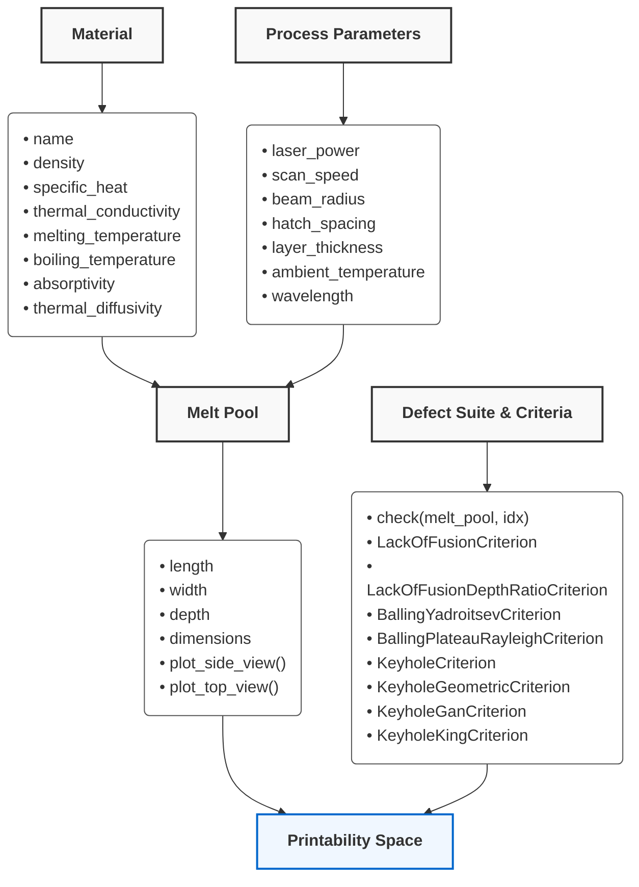

# Architecture and Object Reference

This document provides a detailed breakdown of the `lpbf_printability` library's core architecture and object-oriented design.

## System Flowchart

The library follows a strict **Composition over Inheritance** model to represent physical and operational domains. The objects form a chain of custody where fundamental properties feed into complex solver engines.



---

## 1. `Material`
**Purpose**: Represents the intrinsic physical and thermal properties of the alloy. It is the static component of the simulation. Uses the Factory Pattern to load properties from a local JSON database.

### Initialization
```python
material = Material.from_library("Ti64")
```

### Properties
All numeric fields support `float` or vectorized `np.ndarray` inputs.

* `name` (str): Material name/identifier.
* `density` (float | np.ndarray): Density in $kg/m^3$.
* `specific_heat` (float | np.ndarray): Specific heat capacity in $J/(kg \cdot K)$.
* `thermal_conductivity` (float | np.ndarray): Thermal conductivity in $W/(m \cdot K)$.
* `melting_temperature` (float | np.ndarray): Melting point in $K$.
* `boiling_temperature` (float | np.ndarray): Boiling point in $K$.
* `absorptivity` (float | np.ndarray): Baseline optical absorptivity coefficient (0-1).
* `thermal_diffusivity` (float | np.ndarray | None): Automatically computed based on $k / (\rho \cdot c_p)$ in $m^2/s$ if not provided.

### Methods
* `calculate_absorptivity(method: str = 'hagen-rubens', **kwargs)`: Updates `self.absorptivity` based on wavelength and electrical resistivity.
* `from_library(material_name: str) -> "Material"`: Class method that loads from the packaged JSON database (e.g. `Al6061`, `MoNbTaW`, `NiTi_Sheikh`, `Ti64`).
* `from_dict(data: dict, name: str = "Custom") -> "Material"`: Class method to create a material from a dictionary.

---

## 2. `ProcessParameters`
**Purpose**: Represents the operational machine configuration for L-PBF. Fields support single floats or vectorized NumPy arrays for rapid evaluation grids.

### Initialization
```python
params = ProcessParameters(
    laser_power=200, 
    scan_speed=1.0, 
    beam_radius=50e-6
)
```

### Properties
* `laser_power` (float | np.ndarray): Power of the laser in Watts ($W$).
* `scan_speed` (float | np.ndarray): Velocity of the laser in $m/s$.
* `beam_radius` (float | np.ndarray): Laser beam radius in $m$.
* `hatch_spacing` (float | np.ndarray | None): Distance between adjacent scan tracks in $m$. Required by Lack of Fusion defects. Defaults to `None`.
* `layer_thickness` (float | np.ndarray | None): Powder layer thickness in $m$. Required by Lack of Fusion defects. Defaults to `None`.
* `ambient_temperature` (float | np.ndarray): Baseplate preheating temperature in $K$. Defaults to 298.0K.
* `wavelength` (float | np.ndarray | None): Laser wavelength in $m$. Used to compute absorptivity via the Hagen-Rubens model. Defaults to `None`.
* `shape` (tuple): The N-dimensional grid shape resulting from broadcasting arrays (instance attribute).
* `is_vectorized` (bool): True if parameters evaluate a multidimensional space (computed property).

### Methods
* `get_point(index_tuple: tuple) -> ProcessParameters`: Extracts a single scalar `ProcessParameters` object from a specific point in the N-dimensional space.

---

## 3. `MeltPool`
**Purpose**: The central physics hub. It is the physical manifestation of the laser-material interaction. It acts as a lazy data proxy, only executing complex Eagar-Tsai and Rubenchik solver integration when specific dimensions are requested.

### Initialization
```python
pool = MeltPool(material=material, parameters=params)
```

### Properties
* `length` (np.ndarray): The physical length of the melt pool trailing the laser in $m$.
* `width` (np.ndarray): The full lateral width of the melt pool in $m$.
* `depth` (np.ndarray): The maximum penetration depth into the substrate in $m$.
* `dimensions` (tuple): Returns a 3-tuple `(length, width, depth)` arrays. Evaluates the physics engines the first time it is called.

### Methods (Bridge Pattern Visualizers)
* `plot_side_view(save_path=None, resolution=100, remove_background=False)`: Plots a high-fidelity thermal contour map of the XZ plane. Automatically plots a grid of maps if `params` are vectorized.
* `plot_top_view(save_path=None, resolution=100, remove_background=False)`: Plots a high-fidelity thermal contour map of the XY plane.

---

## 4. `DefectSuite` & `DefectCriterion`
**Purpose**: Decoupled rules engine defining physical limitations. Each `DefectCriterion` enforces a specific boundary condition. `DefectSuite` chains them together by priority.

**Note**: Defect classes are **not** exported from the top-level package and must be imported directly from `lpbf_printability.defects`.

### Available Criteria
* `LackOfFusionCriterion()`: Ensures depth exceeds layer thickness based on geometric hatch spacing overlap.
* `LackOfFusionDepthRatioCriterion(threshold=1.0)`: Ensures depth exceeds `layer_thickness * threshold`.
* `BallingYadroitsevCriterion()`: Ensures `(π * width / length) <= sqrt(2/3)` to prevent capillary instability.
* `BallingPlateauRayleighCriterion(threshold=2.3)`: Ensures the length-to-width ratio does not exceed the threshold.
* `KeyholeCriterion(threshold=2.3)`: Ensures the width-to-depth ratio does not fall below the threshold.
* `KeyholeGeometricCriterion(threshold=2.0)`: Ensures the width-to-depth ratio does not fall below the threshold.
* `KeyholeGanCriterion()`: Energy density threshold based on Gan's keyhole model.
* `KeyholeKingCriterion()`: Dimensionless enthalpy boundary check based on King's keyhole model.

### Initialization
```python
from lpbf_printability.defects import DefectSuite, BallingYadroitsevCriterion, LackOfFusionCriterion

suite = DefectSuite()
suite.add(1, BallingYadroitsevCriterion())
suite.add(2, LackOfFusionCriterion())
```

### Methods
* `evaluate(melt_pool: MeltPool, idx: tuple) -> int`: Given a `MeltPool` context and a grid index, routes the context through the active rules and returns the resulting defect state ID (0 for Safe, >0 for defective).

---

## 5. `PrintabilitySpace`
**Purpose**: The master orchestrator. Takes the evaluated N-dimensional `MeltPool` grid and runs it through the `DefectSuite` rules engine to classify every point.

### Initialization
```python
space = PrintabilitySpace(melt_pool=pool, defect_suite=suite)
space.evaluate()
```

### Properties
* `defect_map` (np.ndarray): An N-dimensional integer array mapping exactly to the `params.shape`, where each value corresponds to the defect state ID.
* `defect_labels` (dict): Dictionary mapping defect IDs to their descriptive names (e.g., `{0: "Safe", 1: "BallingYadroitsevCriterion"}`).

### Methods (Bridge Pattern Visualizers & Helpers)
* `query_material(property_name: str) -> float`: Queries a material property.
* `get_parameter_value(name: str, index: tuple) -> float`: Returns the process parameter value at a given grid index.
* `slice_2d(x_axis: str, y_axis: str, fixed_indices: Optional[dict] = None) -> Tuple[np.ndarray, np.ndarray, np.ndarray]`: Returns the X, Y grids and 2D defect map for a given slice.
* `plot_2d(x_axis="scan_speed", y_axis="laser_power", fixed_indices=None, save_path=None)`: Extracts a 2D plane and plots the full color-coded processing map with safe zones and defect boundaries.
* `plot_3d_safe_zone(x_axis="scan_speed", y_axis="laser_power", z_axis="beam_radius", save_path=None)`: Renders a 3D volume showing how the safe printability window shifts across a third variable (like beam radius or hatch spacing).
